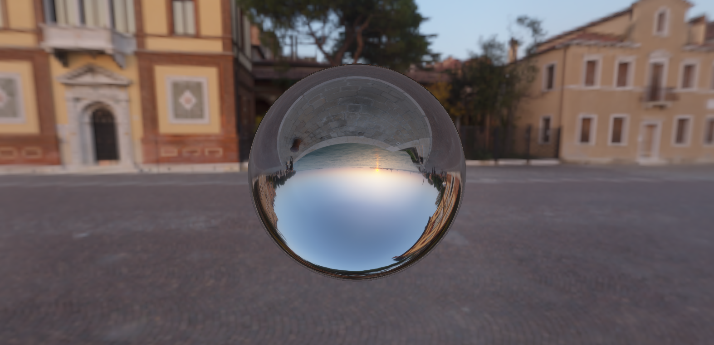
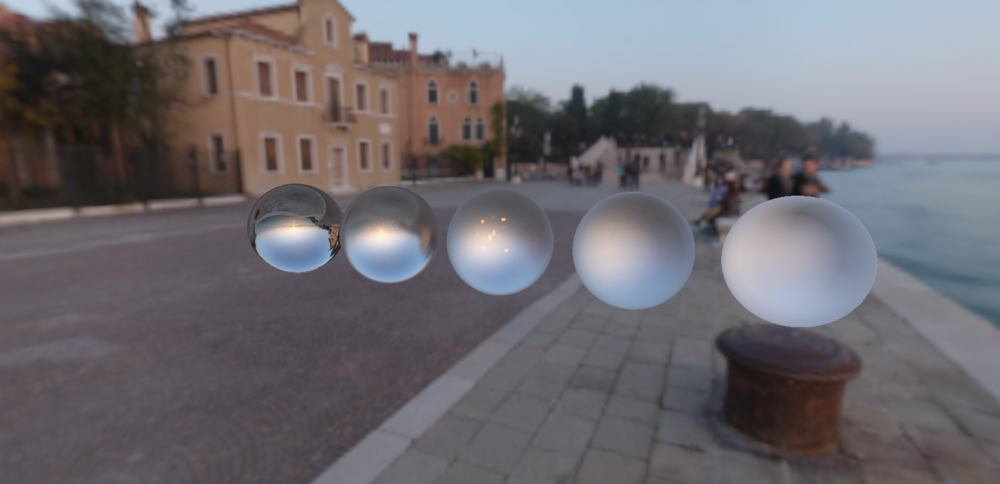
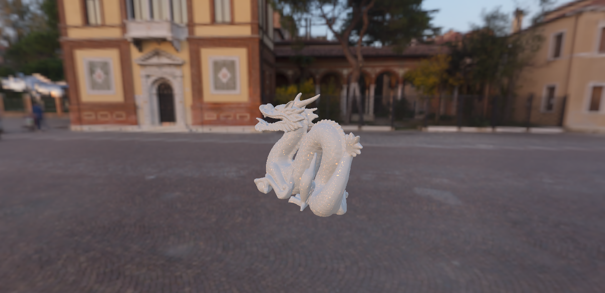
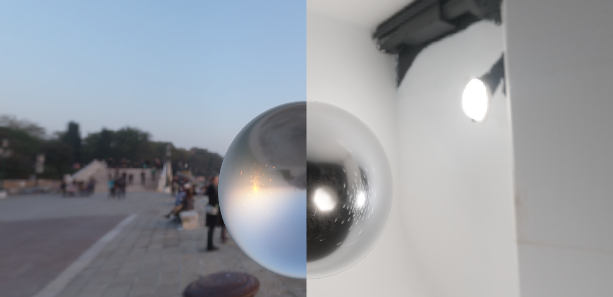

# WebGPU Image-Based Lighting Seminar

Real-time Image-Based Lighting prototype for Advanced Computer Graphics topic `2.9 Image-based lighting`.

## Requirements

- Chrome or Edge with WebGPU support. These browsers are the best targets for testing WebGPU.
- Node.js 20 or newer.
- Windows users should run commands with `npm.cmd` if PowerShell blocks `npm.ps1`.

## Setup

```powershell
npm.cmd install
npm.cmd run dev
```

Open the Vite URL printed by the dev server, usually `http://127.0.0.1:5173/`.
The HDR environments and Stanford models are included under `public/assets/`, so no separate asset download step is needed.

Build check:

```powershell
npm.cmd run build
```

## Screenshots

Chrome sphere with a low roughness material:



Roughness comparison from sharp to soft reflections:



Stanford Dragon rendered with the same IBL shader:



Environment comparison with the same object and material:



## Project Structure

- `src/loaders/`: RGBE HDR and ASCII PLY loading.
- `src/ibl/`: environment preprocessing and IBL texture generation.
- `src/shaders/`: WGSL shader source strings.
- `src/renderer/`: WebGPU render pipelines, camera, and mesh buffers.
- `src/geometry/`: procedural sphere and mesh normalization utilities.
- `src/ui/`: HTML control wiring and stats panel updates.
- `public/assets/`: HDR maps and Stanford model files used by the app.
- `report-assets/`: screenshots used in the report.
- `docs/`: implementation notes and report support material.

## What Is Implemented

- RGBE `.hdr` equirectangular environment loading in linear HDR space.
- GPU equirectangular-to-cubemap conversion.
- GPU diffuse irradiance cubemap convolution.
- GPU GGX specular prefiltered cubemap with roughness mip levels.
- GPU split-sum BRDF integration LUT.
- Real-time PBR shader with Fresnel-Schlick, GGX/Trowbridge-Reitz, Smith geometry, diffuse irradiance, prefiltered specular, tone mapping, and gamma correction.
- Procedural sphere plus Stanford Bunny and Stanford Dragon PLY loading.
- UI for environment, model, material, IBL toggles, skybox, comparison views, and frame/preprocessing stats.

## Asset Sources

The repository includes documented public assets:

- Poly Haven `venice_sunset`, `studio_small_09`, and `kiara_1_dawn` HDRIs, CC0: https://polyhaven.com/license
- Stanford models via the Georgia Tech Large Geometric Models Archive: https://sites.cc.gatech.edu/projects/large_models/

No assets are required from an undocumented private source.

## View Modes

- `Final PBR`: full IBL material rendering.
- `Environment A/B`: split-screen comparison between the two HDR environments.
- `Roughness spheres`: five spheres at roughness `0, 0.25, 0.5, 0.75, 1.0`.

## Notes

The main lighting is IBL. Changing the HDR environment changes both the object lighting and reflections.

## License

Project code is released under the MIT License. See `LICENSE`.

Downloaded HDR environments and Stanford models keep their own source licenses or terms. See the asset source links above.
